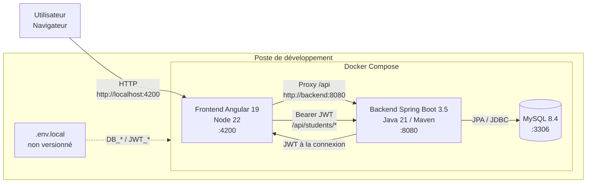
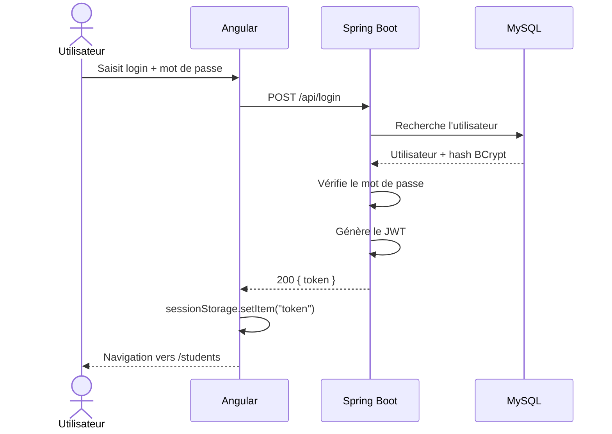

# Architecture globale

Ce schéma présente l'architecture d'exécution de l'application `oc-p2`.



## Flux principal

```text
Navigateur
→ Angular
→ proxy de développement
→ Spring Boot
→ JPA
→ MySQL
```

Le frontend est servi sur `127.0.0.1:4200`, le backend sur `127.0.0.1:8080` et MySQL sur `127.0.0.1:3306`.

Les services restent donc exposés uniquement sur l'interface locale du poste.

## Authentification

Le parcours d'authentification est :



Les appels vers `/api/students` reçoivent ensuite automatiquement le header :

```text
Authorization: Bearer <token>
```

via l'interceptor Angular.
