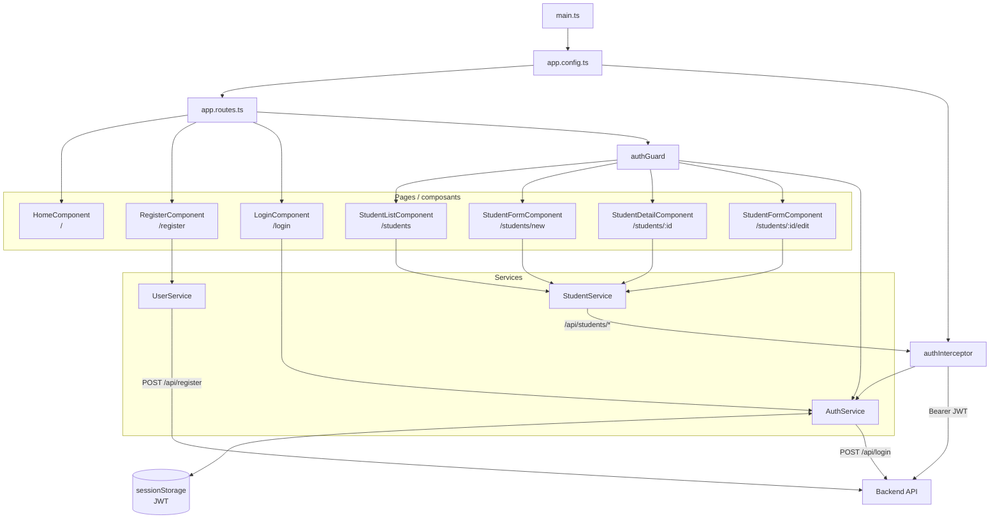

# Architecture frontend

Le frontend est une application Angular 19 en composants standalone.



## Responsabilités

### Routing

Les routes publiques sont :

```text
/
/register
/login
```

Les routes protégées par `authGuard` sont :

```text
/students
/students/new
/students/:id
/students/:id/edit
```

### Services

`UserService` porte l'inscription :

```text
POST /api/register
```

`AuthService` porte la connexion et la gestion locale du token :

```text
POST /api/login
sessionStorage
```

`StudentService` porte les cinq opérations CRUD :

```text
POST   /api/students
GET    /api/students
GET    /api/students/:id
PUT    /api/students/:id
DELETE /api/students/:id
```

### Sécurité côté frontend

`authGuard` empêche l'accès aux écrans étudiants lorsqu'aucun token n'est présent.

`authInterceptor` ajoute le Bearer Token uniquement aux requêtes commençant par :

```text
/api/students
```

L'inscription et la connexion restent donc des appels publics.
