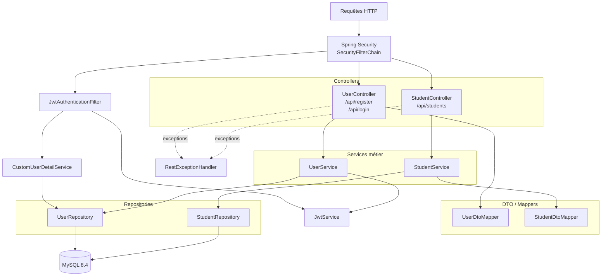
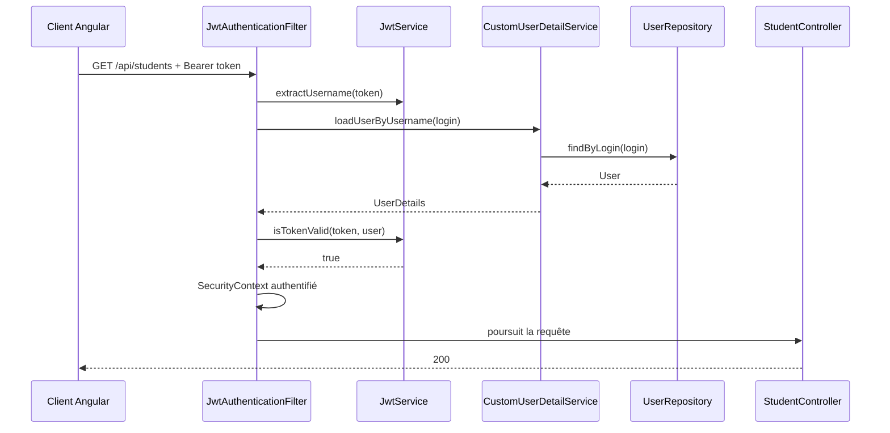

# Architecture backend

Le backend suit une architecture en couches Spring Boot.



## Authentification et sécurité

La configuration Spring Security est stateless.

Les endpoints publics sont :

```text
/actuator/health
/api/register
/api/login
```

Toutes les autres requêtes doivent être authentifiées.

Le filtre JWT est exécuté avant `UsernamePasswordAuthenticationFilter`.



## Couches CRUD étudiant

```text
StudentController
→ StudentService
→ StudentDtoMapper
→ StudentRepository
→ MySQL
```

Les entrées/sorties HTTP utilisent des DTO ; les entités JPA ne sont pas exposées directement par les controllers.
