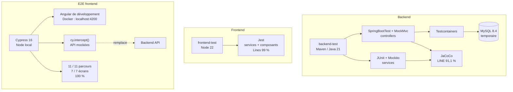

# Architecture et stratégie de tests

Le projet sépare les tests backend, frontend et E2E.



## Backend

Commande de référence :

```bash
docker compose -f compose.test.yaml run --rm backend-test mvn verify
```

Les tests unitaires utilisent JUnit et Mockito.

Les tests d'intégration utilisent :

```text
Spring Boot Test
MockMvc
Testcontainers
MySQL 8.4
```

La base créée par Testcontainers est temporaire et indépendante du volume MySQL de développement.

Rapport :

```text
repos/backend/target/site/jacoco/index.html
```

Résultat actuel :

```text
JaCoCo LINE : 91,1 %
Seuil       : 80 %
```

## Frontend Jest

Commande de référence :

```bash
docker compose -f compose.test.yaml run --rm frontend-test npm run test:coverage
```

Rapport :

```text
repos/frontend/coverage/index.html
```

Résultat actuel :

```text
Jest Lines : 99 %
Seuil      : 80 %
```

## Cypress

Cypress est exécuté localement avec Node contre le serveur Angular de développement exposé sur `localhost:4200`.

```bash
npm run e2e:verify
```

Les API sont mockées avec `cy.intercept()` conformément au périmètre E2E.

Résultat actuel :

```text
11 / 11 parcours passent
7 / 7 écrans couverts
Couverture parcours : 100 %
Couverture écrans   : 100 %
```

Rapport :

```text
repos/frontend/reports/e2e-coverage.md
```

## Séparation des responsabilités

```text
JUnit / Mockito
→ logique backend

MockMvc / Testcontainers
→ intégration controller → base

Jest
→ services, Guards, interceptor et composants Angular

Cypress
→ parcours utilisateur et couverture des écrans
```

Le taux de réussite des tests n'est pas utilisé comme substitut au taux de couverture.
